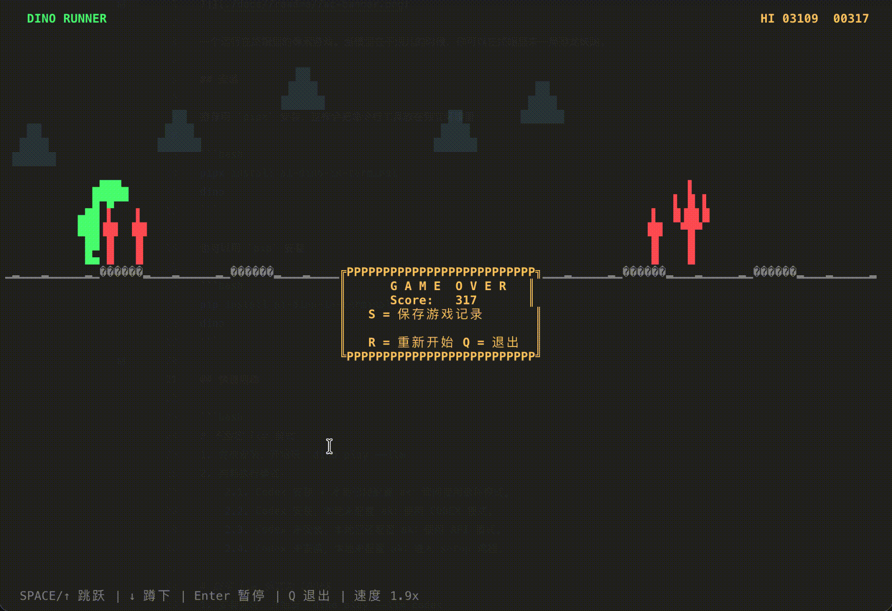

# DINO: 一款可以让 AI 玩的终端游戏



## 安装

推荐用 `pipx` 安装，这样会把命令行工具放在独立环境里：

```bash
pipx install ai-dino-in-terminal
dino
```

也可以用 `pip` 安装：

```bash
pip install ai-dino-in-terminal
dino
```

## 快速开玩

手动模式。
```bash
dino # 或者 `dino play`
```

AI 模式，不指定 provider。
```bash
# 1. 完成安装
# 2. 判断执行模式：
#    2.1. Codex 安装 + 本地已经配置 ak：询问使用哪种模式。
#    2.2. Codex 安装，本地未配置 ak：使用 CODEX 模式。
#    2.3. Codex 未安装，本地已经配置 ak：使用 API 模式。
#    2.4. Codex 未安装，本地未配置 ak：进入 setup 流程。

dino play --llm
```

AI 模式，指定 provider 为本地 Codex。
 ```bash
# 1. 安装完成
# 2. 判断本地 Codex 是否安装（符合版本要求）
#    2.1. Codex 安装，进入游戏。
#    2.2. Codex 未安装，提示安装，终止游戏。

dino play --llm codex
 ```

AI 模式，指定 provider 为 API (OpenAI Response)。
 ```bash
# 1. 安装完成，开始玩
# 2. 判断本地配置文件：
#    2.1. 已经配置 ak，进入游戏。
#    2.2. 未配置 ak，进入 setup 配置流程。

dino play --llm api
 ```

## 其他玩法

### 保存游戏记录

手动模式和 LLM 结束后，可以选择保存本局记录。后续可以回放或者在竞技模式中使用。

### 观看回放

通过 `dino replay` 选择一局游戏记录回放。

### 竞技模式

通过 `dino compete` 选择一局游戏记录，可以一边看回放一边跟玩。

## 完整指令说明

| 命令 | 说明 | 依赖 |
|------|------|------|
| `dino` / `dino play` | 手动操作恐龙 | 无 |
| `dino play --llm` | 自动选择 API 或 CODEX 模式 | API 配置或 Codex CLI |
| `dino play --llm api` | 使用 OpenAI Responses API 决策 | `~/.config/ai-dino-in-terminal/config.json` 或启动时交互输入 |
| `dino play --llm codex` | 使用本地 Codex CLI 决策 | Codex CLI，且版本满足要求 |
| `dino play --llm --debug` | 使用 LLM 决策并写 JSONL 调试日志 | `logs/*.jsonl` |
| `dino dashboard` | 查看带动画 banner 的累计得分和 token dashboard | `~/.config/ai-dino-in-terminal/game_records.jsonl` |
| `dino replay` | 从历史运行记录列表选择并重放 | `replays/*.json` |
| `dino replay +list` | 浏览所有 replay 文件，回车查看元信息 | `replays/*.json` |
| `dino replay +clear` | 清除所有 replay 记录文件 | `replays/*.json` |
| `dino compete` | 从历史运行记录列表选择一局并进入双赛道竞技 | `replays/*.json` |
| `dino config` | 查看本地 LLM 配置（API key 脱敏显示） | 无 |
| `dino config +setup` | 交互式写入本地 API LLM 配置 | API key / base_url / model |
| `dino setup` | 交互式写入本地 API LLM 配置 | API key / base_url / model |
| `dino config +reset` | 重置本地 LLM 配置 | 无 |
| `dino help` | 查看可用命令和公共参数 | 无 |


## 运行要求

- Python 3.11+
- 支持 `curses` 的终端环境
- 游戏本身无第三方运行时依赖
